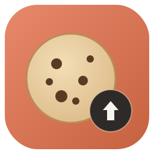

<p align="center">
  
</p>

<h1 align="center">claude-cookie-backup</h1>

<p align="center"><em>Respaldo automático de tu sesión de claude.ai en Google Drive.</em></p>

Saca automáticamente los cookies de tu sesión web de **claude.ai** y los respalda
en **Google Drive**, para poder reabrir tu cuenta en otra PC (o si esta se daña /
sales del país) sin contraseña: importas los cookies con **EditThisCookie** y entras.

Corre solo cada N días (y a demanda), rota los backups, tiene interfaz gráfica y se
reinstala en una máquina nueva en minutos.

---

## Cómo funciona

```
Chrome (sesión claude.ai)
        │  browser_cookie3 lee la BD de cookies + KWallet
        ▼
   extract.py  ──► out/claude-cookies-FECHA_HORA.json   (local, rota a 3)
        │
        ├─ rclone sync ──► Google Drive: gdrive:<nombre-pc>/   (rota a 3 por PC)
        └─ (opcional) POST ──► Google Sheet (Apps Script)
        ▲
   systemd --user timer  (cada N días + ~5 min tras cada arranque)
```

- **Solo `sessionKey` importa** para reabrir la sesión; los cookies de Cloudflare
  (`__cf_bm`, `_cfuvid`) se regeneran solos. Por eso el respaldo periódico tiene
  sentido: `sessionKey` caduca (~28 días) y hay que refrescarlo.
- El script **aborta sin sobrescribir** si no encuentra `sessionKey` (sesión cerrada
  o lectura fallida), así nunca guarda un backup vacío encima del bueno.

> ⚠️ **El cookie nace en el navegador donde inicias sesión.** La extracción SIEMPRE
> corre en la PC donde usas Claude — un servidor pelado no tiene sesión que leer.
> Lo que sobrevive a perder la PC es el cookie ya subido a Drive (válido ~28 días)
> y este proyecto (zipeado en Drive).

---

## Seguridad

- A Drive sube el JSON **en texto plano** (sin cifrado — decisión deliberada para que
  sea fácil copiar/pegar). El `sessionKey` = acceso total a tu cuenta: cuida quién
  ve esa carpeta de Drive y el token de rclone (`~/.config/rclone/rclone.conf`).
- Nunca se versiona ningún cookie ni token: `out/` y la config de rclone están fuera
  del repo (ver `.gitignore`).
- Si alguna vez quieres cifrado en reposo, se añade con `gpg`/`age` antes del `sync`.

---

## Requisitos

- Linux con `systemd` y sesión de usuario (KDE/GNOME).
- **Chrome** (o Brave/Chromium/Edge/Firefox) con tu sesión de claude.ai abierta.
- Python 3 con `tkinter` (para la GUI) — viene en la mayoría de distros.
- KWallet/Keyring desbloqueado (Chrome cifra su clave de cookies ahí). Se recomienda
  KWallet **con contraseña vacía** para que el timer no se trabe pidiéndola.

`install.sh` instala lo demás (`browser_cookie3` y `rclone`).

---

## Instalación

```bash
bash install.sh
```

Hace todo, idempotente (puedes repetirlo para reconfigurar):

1. Instala `browser_cookie3` en tu Python.
2. Instala `rclone` en `~/.local/bin` si falta.
3. Si no existe el remoto `gdrive`, te dice el comando para autorizarlo:
   ```bash
   ~/.local/bin/rclone config
   # remoto: gdrive | tipo: drive | scope: 1 | autorizar en el navegador
   ```
   (Eso necesita tu navegador una vez; luego re-corres `install.sh`.)
4. Apunta el remoto a tu carpeta de Drive (`root_folder_id`).
5. Pregunta cada cuántos días, cuántos backups conservar y (opcional) la URL del Sheet.
6. Crea y activa el **timer** de systemd y el **lanzador** en el menú de apps.

---

## Uso

### Interfaz gráfica
Búscala en el menú como **«Claude · Cookie Backup»**, o:
```bash
python3 gui.py
```
Botones: **Extraer ahora**, **Copiar sessionKey**, **Copiar JSON completo**
(para pegar en EditThisCookie), **Abrir carpeta**, y selector de intervalo
**10 / 15 / 20 / 30 días**.

### Línea de comandos
```bash
systemctl --user start claude-cookies                # extraer YA, a demanda
systemctl --user list-timers claude-cookies.timer    # ver próximo disparo
journalctl --user -u claude-cookies -n 20            # ver el último resultado
python3 extract.py --self-test                       # chequear la lógica
```

---

## Programación y reinicios

- El timer está `enabled` → systemd lo recarga en **cada arranque**.
- `OnBootSec=5min` → intenta una extracción ~5 min después de encender.
- `OnUnitActiveSec=Nd` → además cada N días mientras la PC esté prendida.
- Con `Linger=yes`, el *user manager* arranca al boot aunque no inicies sesión.
- **Caveat inofensivo:** si una corrida cae con el KWallet aún bloqueado (antes de
  iniciar sesión gráfica), aborta limpia y la siguiente sale bien. No se pierde nada.

---

## Multi-PC

Instala lo mismo en cada PC donde uses Claude. Cada una sube a **su propia subcarpeta**
`gdrive:<hostname>/`, así los `rclone sync` (que espejan) **no se borran entre sí** y
si una PC se daña, las demás siguen sacando cookies frescos.

---

## PC nueva (o si se daña esta)

1. Inicia sesión en claude.ai en **Chrome**.
2. Baja `claude-cookie-backup.zip` desde tu carpeta de Drive (o `git clone` del repo).
3. `bash install.sh` (te guía con el `rclone config` si falta autorizar Drive).

Mientras tanto, para **entrar ya**: en Drive → subcarpeta de la PC vieja → abre el
`.json` más nuevo → cópialo → pégalo en EditThisCookie (ver abajo).

---

## Restaurar la sesión en otra PC

1. Instala la extensión **EditThisCookie** (v3) en el navegador.
2. Consigue el JSON:
   - **Drive:** abre el `.json` más nuevo de tu carpeta y copia todo.
   - **Sheet** (si lo configuraste): copia la celda `json_completo` de la fila de arriba.
3. En claude.ai → EditThisCookie → **Import** → pega el JSON → guarda.
4. Recarga la página. Estás dentro.

---

## Google Sheet (opcional)

Para copiar/pegar el cookie desde el móvil. Pega `sheet.gs` en el Apps Script de un
Google Sheet, despliégalo como app web («Cualquier usuario») y pon esa URL en
`install.sh`. Cada extracción agrega una fila (fecha · sessionKey · JSON completo) y
deja las 3 más nuevas.

---

## Rotación

Cada corrida escribe `claude-cookies-AAAA-MM-DD_HH-MM-SS.json` y borra los viejos
dejando los `KEEP` más nuevos (default 3), tanto en local como en la subcarpeta de
Drive de esa PC. El Sheet hace lo mismo con sus filas.

---

## Archivos

| Archivo | Qué hace |
|---|---|
| `extract.py` | Lee cookies, arma el JSON (formato EditThisCookie), guarda local, rota, sube a Drive y/o al Sheet. Tiene `--self-test`. |
| `gui.py` | Interfaz Tkinter (sin dependencias): extraer, copiar, abrir carpeta, cambiar intervalo. |
| `install.sh` | Instalador todo-en-uno (deps + rclone + remoto + timer + lanzador). |
| `sheet.gs` | Apps Script para el Google Sheet opcional. |
| `out/` | Backups locales (ignorado por git). |

---

## Detalles técnicos (gotchas)

- **`browser_cookie3` mezcla unidades:** devuelve `expires` en **segundos** para
  Chrome pero en **milisegundos** para Firefox. Por eso `extract.py` elige **un solo
  navegador** (el del `sessionKey` con expiración más tardía) y normaliza a segundos
  (`>1e11` ⇒ ms ⇒ /1000). Así el set es consistente y de una sola sesión.
- Salida con `sort_keys=True` para igualar el orden de campos de EditThisCookie; las
  cookies de sesión omiten `expirationDate`.
- El service usa `sys.executable` (no el shim de pyenv) para que systemd lo encuentre.
- `rclone sync` por-PC usa `socket.gethostname()` como subcarpeta.

---

## Reconfigurar / desinstalar

```bash
bash install.sh                                      # vuelve a preguntar todo
systemctl --user disable --now claude-cookies.timer  # apagar
rm ~/.config/systemd/user/claude-cookies.{service,timer}
rm ~/.local/share/applications/claude-cookie-backup.desktop
```

---

## Limitaciones

- Necesita un navegador con sesión activa para extraer (no funciona «solo en un
  servidor»). Para 24/7 independiente de tu PC harías falta un VPS con un navegador
  real logueado, con el riesgo de que Anthropic marque el login desde datacenter.
- Sin cifrado en reposo (por decisión).
